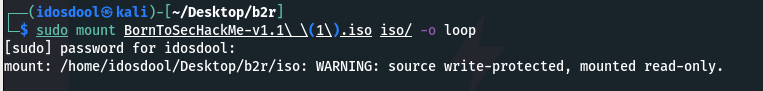
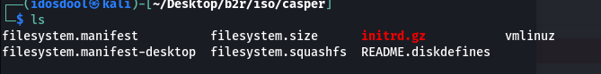
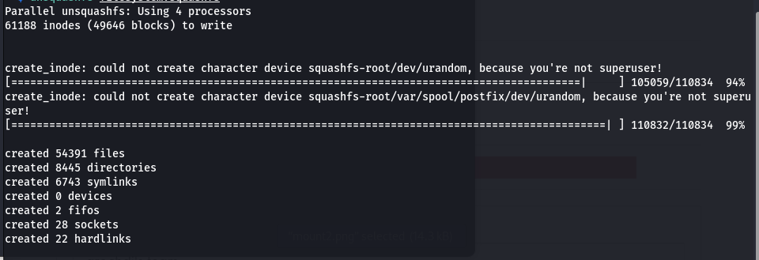
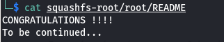

# Boot2Root

In this method we will retrieve the `squashfs` file , so you need to mount the iso using the following command :

```bash
mkdir iso && sudo mount ${iso_file_name} -o loop iso/
```



Now you need to navigate to casper and get the file `filesystem.squashfs`



After the mount you got read-only directory so you need to cp the file to another workspace and then you can extract all files in the vm using the cmd `unsquash filesystem.squashfs` 



Bingo you got acces to all root folders and files


